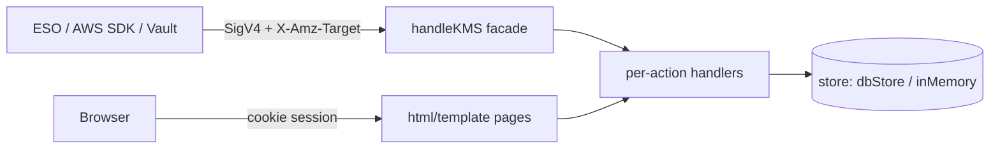
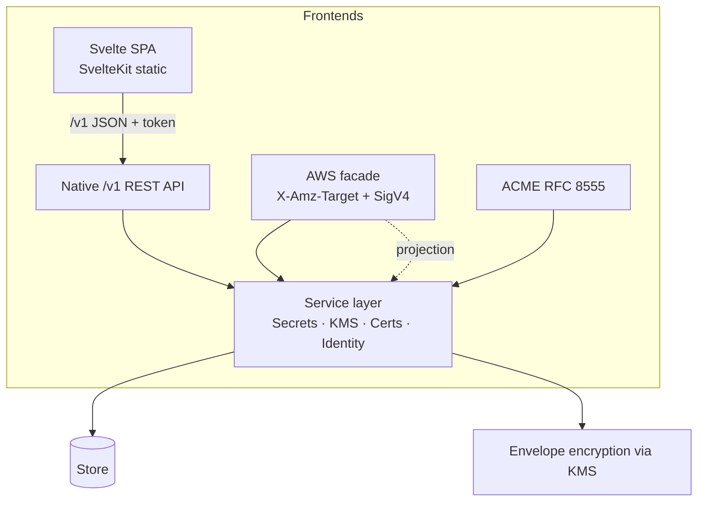
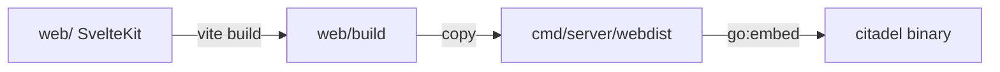
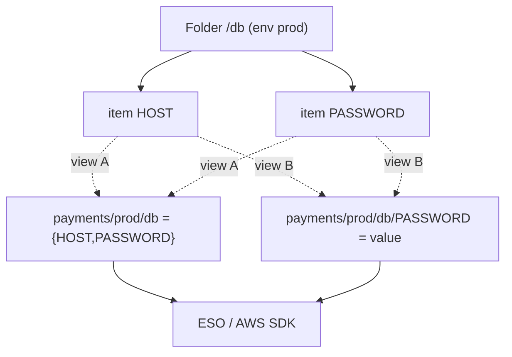

# Citadel — Product & Architecture Plan

> Evolving `go-kms` from an AWS auto-unseal helper into **Citadel**: a self-hosted,
> Infisical-style platform for **Secrets Management, KMS, and Certificate Management** —
> with a modern **Go + Svelte** control plane and **full AWS API compatibility** retained
> so existing integrations (External Secrets Operator, AWS SDK, Vault auto-unseal) keep
> working unchanged.

---

## 1. Vision

Citadel started life as a KMS shim to provide HashiCorp Vault auto-unseal. It has since
grown three real services — **KMS**, **Secrets Manager**, and **ACM / PCA certificate
management** — each implemented as a thin AWS-compatible facade over a shared store.

The goal now is to make Citadel **its own product** with an Infisical-class developer
experience, while treating AWS API compatibility as a permanent **compatibility adapter**
rather than the primary identity.

### Guiding principles

1. **AWS compatibility is a facade, not the core.** The `X-Amz-Target` + SigV4 surface
   (`handleKMS`, `cmd/server/main.go`) is one of *several* front doors. It stays forever so
   ESO / AWS SDK / Vault keep working.
2. **One shared service layer.** Business logic lives in protocol-free service functions.
   Every front door (AWS facade, native `/v1` REST API, web UI) calls the same services.
3. **Native model in, AWS shape out.** The rich Infisical-style hierarchy is the source of
   truth; the AWS Secrets Manager surface is a *projection* (view) over it.
4. **Account = Organization.** Each tenant (`ui_accounts` row) is the org boundary and
   directly holds typed products (KMS / Secrets / Certs).
5. **Modern UI/UX.** Replace the server-rendered `html/template` admin pages with a
   **Svelte (SvelteKit) single-page app** served by the Go binary, talking to the native
   `/v1` JSON API.

---

## 2. Where we are today

| Area | Current state |
|---|---|
| Language / runtime | Go `1.25`, module `github.com/worlddrknss/go-kms` |
| HTTP | `net/http` + `http.ServeMux`, middleware chain (panic/security-headers/logging) |
| AWS API | Single dispatch in `handleKMS` (`cmd/server/main.go`) switching on `X-Amz-Target`: `TrentService.*` (KMS), `secretsmanager.*` (Secrets), `acm-pca.*` / `acm.*` (Certs) |
| Auth | SigV4 (`sigv4_db_backed.go`), DB-backed access keys = machine identities |
| ACME | RFC 8555 endpoints for certificate issuance |
| Storage | `dbStore` (Postgres via `lib/pq`) and `inMemoryStore`, behind a store interface |
| UI | Server-rendered Go `html/template` pages embedded via `//go:embed templates/*.html`, "Citadel" CSS design system inline in each template |
| Tenancy | `ui_accounts(account_id)` exists; `user_accounts(username, account_id)`; **but `sm_secrets.name` is still a global PK** — not yet per-account isolated |

### The AWS-compat seam (already thin)



Every AWS action already delegates to an internal handler that operates on Citadel's own
types and store. Decoupling is therefore **additive**, not a rewrite.

---

## 3. Target architecture



- **Service layer** (`internal/secrets`, `internal/kms`, `internal/certs`, `internal/identity`):
  protocol-free, no `http`, no AWS types, no ARNs in signatures.
- **AWS facade**: translates `X-Amz-Target` JSON ↔ service calls; renders AWS-shaped ARNs
  and error envelopes. Lives behind a `CITADEL_AWS_COMPAT` flag (default on).
- **Native `/v1` API**: clean REST/JSON, native auth (API token / session), native resource
  IDs. First-class surface for the Svelte UI and native SDKs.
- **Svelte SPA**: built to static assets, embedded into the Go binary via `embed.FS`, served
  under `/app` (and `/` redirects there for browsers). Single binary deploy preserved.

---

## 4. Frontend: Go + Svelte

### Stack

- **SvelteKit** with `@sveltejs/adapter-static` → produces a static SPA (no Node runtime in
  production).
- **TypeScript**, **Vite** dev server with proxy to the Go API during development.
- A small **design-system** package reproducing the existing "Citadel" tokens
  (`--c-bg`, `--c-side`, `--sw: 232px`, `--th: 56px`, `.shell/.sidebar/.topbar/.btn/...`) as
  Svelte components, so the new UI matches the current look but is component-driven.

### Repository layout (additive)

```
/                      # Go module root
  cmd/server/          # existing Go server (gains /v1 API + static embed)
  internal/            # NEW service layer (secrets/kms/certs/identity)
  web/                 # NEW SvelteKit app
    src/
      lib/             # design-system components, API client
      routes/          # /login, /secrets, /kms, /certificates, /audit, /admin, /account
    static/
    svelte.config.js
    vite.config.ts
  cmd/server/webdist/  # build output embedded via go:embed (generated, git-ignored)
```

### Build & serve model

1. `npm --prefix web run build` → static assets in `web/build`.
2. A small build step copies `web/build` → `cmd/server/webdist/`.
3. Go embeds it: `//go:embed all:webdist` → served by `http.FileServer` under `/app/*`,
   with an SPA fallback (unknown non-API paths return `index.html`).
4. Result: **single self-contained Go binary**, same as today.



### Dev workflow

- Terminal 1: `go run ./cmd/server` (API on `:8080`).
- Terminal 2: `npm --prefix web run dev` (Vite on `:5173`, proxies `/v1` + `/api` → `:8080`).
- Hot-reload UI against the live Go API; production stays a single binary.

### Migration strategy (no big-bang)

- Keep existing `html/template` pages serving until each screen is reimplemented in Svelte.
- Route by prefix: `/app/*` → Svelte SPA; legacy `/secrets`, `/admin`, … remain until parity.
- Cut over screen-by-screen (Secrets first — highest value), then flip `/` to `/app`.
- Delete a legacy template only once its Svelte equivalent ships.

---

## 5. Secrets: Infisical-style model (with AWS projection)

### Concept mapping

| Infisical | Citadel | Today |
|---|---|---|
| Organization | Master Account / deployment + `/admin` | exists |
| Project / Account | `ui_accounts(account_id)` (Account **is** the org) | exists |
| Typed projects (Secrets/PKI/KMS) | existing KMS / Secrets / ACM-PCA services | exists |
| **Environment** (dev/staging/prod) | NEW | — |
| **Folder + KEY=value item** | NEW | flat `sm_secrets.name` |
| Machine identity | access keys | exists |
| User identity | `user_accounts` | exists |
| RBAC / policies | RBAC page (extend to env-scoped) | partial |
| Audit | audit explorer | exists |

### New tables (additive; `sm_secrets` retained as a compatibility view)

```sql
sm_projects(id, account_id FK ui_accounts, slug, name, UNIQUE(account_id, slug))
sm_environments(id, project_id FK, slug, name, UNIQUE(project_id, slug))
sm_items(id, env_id FK, folder DEFAULT '/', key, kms_key_id FK kms_keys,
         UNIQUE(env_id, folder, key))
sm_item_versions(item_id FK, version, enc_value_b64, created_at, created_by,
         PRIMARY KEY(item_id, version))
```

### AWS projection — **support both name shapes**

The same `sm_items` rows are exposed two ways so any consumer picks what it needs:

- **Folder → one AWS secret**: name `project/env/folder`, `SecretString` = JSON of all keys
  in that folder. ESO reads whole-JSON or `remoteRef.property: KEY`.
- **Key → its own AWS secret**: name `project/env/folder/KEY`, `SecretString` = single value.



ESO and AWS SDK never see the hierarchy — they read a flat projection. **Zero ESO config
change required.**

---

## 6. Phased roadmap

> ESO / AWS-SDK impact is **none** at every phase until the optional native provider (P9).

### Status

**Shipped in `v1.15.0` — first end-to-end vertical slice (projection-first):**
the native `/v1` JSON API + the embedded **Svelte** control plane are live. The
Infisical-style **Project → Environment → Folder → Item** hierarchy is projected
onto the existing AWS-compatible secrets store (item ⇒ secret named
`<project>/<env>/<folder>/<KEY>`), so the same data is simultaneously editable in
the new UI and readable through the AWS Secrets Manager API (verified end-to-end,
ESO path included). This collapses the *interfaces* of P3–P6 into one safe,
additive layer without disturbing the live AWS path. Dedicated hierarchy tables,
the `(account_id, name)` PK migration, and per-screen Svelte parity remain as
follow-ups below.

**Completed `P1`–`P9` (end-to-end, additive, gates green):**

- **P1** — Per-account isolation: in-memory store keys secrets by
  `(account, name)`; Postgres scoping via `accountFilter`/`accountForContext`.
  Two accounts can hold the same name without collision (tested).
- **P2** — Protocol-free service layer (`secrets_service.go`): the native API
  delegates to one shared `secretsService`; no `http`/AWS types in its signatures.
- **P3** — Native hierarchy tables (`sm_projects`/`sm_environments`/`sm_folders`)
  implemented on both stores via `hierarchyStore`; empty projects/envs/folders
  surface in the UI (tested).
- **P4** — AWS projection both shapes: a `GetSecretValue` for a folder name now
  returns a JSON object of all keys (`FolderJSONByName`), while per-key reads are
  unchanged — zero ESO config change (tested + verified at runtime).
- **P5** — Native `/v1` REST expanded: create project/environment/folder, list
  versions, restore (PITR); plus **bearer-token machine-identity auth**
  (`Authorization: Bearer <keyId>:<secret>`) alongside cookie sessions.
- **P6** — Svelte SPA scaffold (shipped in v1.15.0).
- **P7** — Svelte parity screens for **KMS, Certificates, Audit, Account,
  Admin** backed by new read-only `/v1` endpoints; site root `/` now redirects
  to `/app/` (legacy `html/template` pages remain reachable until fully retired).
- **P8** — **Secret references** (`${KEY}`, `${/abs/path/KEY}`) expanded at reveal
  time (`?resolve=true`); **PITR** via restore; **env-scoped RBAC hook**
  (`canAccessEnv`); **approval-workflow scaffolding** (create → review →
  approve/reject change requests, per-account) (tested).
- **P9** *(optional)* — Native Go **SDK** (`sdk/citadel`) over `/v1` with token
  auth; native **OIDC identity extension point** (`verifyNativeOIDC`) wired into
  the bearer path as a forward-compatible scaffold.


| Phase | Deliverable | Risk | Suggested tag |
|---|---|---|---|
| **P1** | **Multi-tenant scoping**: `sm_secrets` keyed by `(account_id, name)`, `account_id` NOT NULL (backfill to deployment account); activate `accountFilter` plumbing in `caller_account.go` | Low | `v1.15.0` |
| **P2** | **Service layer extraction**: move Secrets business logic out of AWS handlers into `internal/secrets`; AWS facade calls it. Tests stay green | Low | `v1.16.0` |
| **P3** | **Native hierarchy**: `sm_projects/environments/items/item_versions` + service methods | Med | `v1.17.0` |
| **P4** | **AWS projection (both shapes)**: read/write `sm_secrets` view over native items | Med | `v1.18.0` |
| **P5** | **Native `/v1` REST API** for Secrets (projects/envs/folders/items/versions) + token auth | Med | `v1.19.0` |
| **P6** | **Svelte SPA scaffold**: SvelteKit + static adapter + `embed.FS` serving + design-system components + login/session; ship Secrets editor screen first | Med | `v1.20.0` |
| **P7** | **Svelte parity**: reimplement KMS, Certificates, Audit, Admin, Account screens; flip `/` to `/app`; retire `html/template` pages | Med | `v1.21.0` |
| **P8** | **Secret references** (`${KEY}`, `${/shared/db/HOST}`), env-scoped RBAC, point-in-time recovery, approval workflow scaffolding | Med | `v1.22.0` |
| **P9** | *(optional)* native ESO provider / native SDK; native identity (OIDC) alongside SigV4 | Higher | `v2.0.0` |

---

## 7. Phase 1 detail (next up)

**Goal:** make secrets per-account isolated — the foundation the multi-tenant model requires.

- Schema: `ALTER TABLE sm_secrets` → backfill `account_id` from deployment account, set
  `NOT NULL`; change PK / uniqueness from `name` to `(account_id, name)`; add supporting
  indexes. Keep `arn` unique globally (ARNs already embed account).
- Store: thread `account_id` through `CreateSecret` / `DescribeSecret` / `GetSecretValue` /
  `ListSecrets` / version + tag lookups; use the existing `accountFilter` /
  `accountForContext` helpers in `caller_account.go` (currently inert).
- Behavior: when no caller account is present (admin UI / non-strict), fall back to the
  deployment account so existing single-tenant deployments are unaffected.
- Tests: extend `secrets_manager_*_test.go` to assert two accounts can hold the same secret
  name without collision and cannot read each other's values.
- Gates: `go build ./...`, `go vet ./cmd/server/`, `gofmt -l` clean before commit.

---

## 8. Cross-cutting concerns

- **Encryption:** secret values stay envelope-encrypted via Citadel KMS (`kms_key_id` per
  item). No plaintext at rest.
- **Audit:** every native + AWS action records an audit event (existing `recordAudit`);
  surface org-level and project-level views in the Svelte audit screen.
- **Security:** preserve SigV4 verification for the AWS facade; add bearer/API-token auth for
  `/v1`; keep panic-recovery + security-headers middleware; SPA served with strict CSP.
- **Backwards compatibility:** `CITADEL_AWS_COMPAT=true` (default) keeps the AWS facade on;
  setting it off serves only the native API + UI.
- **Single-binary deploy:** unchanged — Svelte assets embed into the Go binary.

---

## 9. Conventions

- Semver annotated tags (latest `v1.14.1`); conventional commits (`feat(...)`, `fix(...)`).
- Push `main` + tag together.
- Each phase ships independently with build/vet/format gates green and tests passing.
